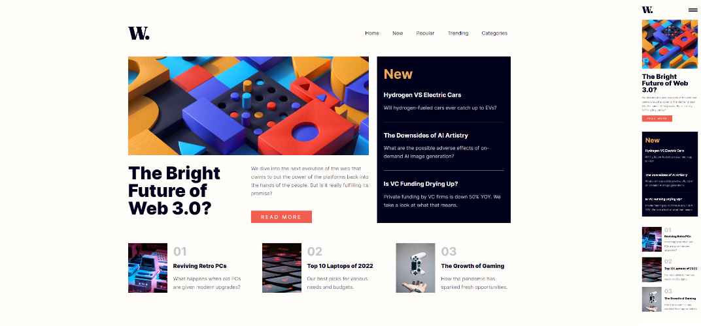

# Frontend Mentor - News homepage solution

This is a solution to the [News homepage challenge on Frontend Mentor](https://www.frontendmentor.io/challenges/news-homepage-H6SWTa1MFl).

## Table of contents

- [Frontend Mentor - News homepage solution](#frontend-mentor---news-homepage-solution)
  - [Table of contents](#table-of-contents)
  - [Overview](#overview)
    - [The challenge](#the-challenge)
    - [Screenshot](#screenshot)
    - [Links](#links)
  - [My process](#my-process)
    - [Built with](#built-with)
    - [What I learned](#what-i-learned)
  - [Author](#author)

**Note: Delete this note and update the table of contents based on what sections you keep.**

## Overview

### The challenge

Users are able to:

- View the optimal layout for the interface depending on their device's screen size
- See hover and focus states for all interactive elements on the page

### Screenshot



### Links

- Solution URL: [Add solution URL here](https://your-solution-url.com)
- Live Site URL: [Add live site URL here](https://your-live-site-url.com)

## My process

### Built with

- Semantic HTML5 markup
- CSS custom properties
- Flexbox
- Sass
- JavaScript

### What I learned

I practiced Sass, its functions, how partials could be organized and BEM in this solution (class names can really be long but I never regreted using BEM) since it goes well with Sass, as well as building a page exactly by design. JavaScript determines device's width to decide if website should use a burger button menu or a regular menu, disables scrolling, appends a dark overlay behind the menu in its active state etc. 

Learned more about responsive typography and some newer CSS functions: 
```css
font-size: clamp(4rem, 2.3vw + 2.2rem, 5.3rem);
```


## Author

- Website - [webdevlpr.com](https://webdevlpr.com/)
- Frontend Mentor - [@Curiositz](https://www.frontendmentor.io/profile/Curiositz)
