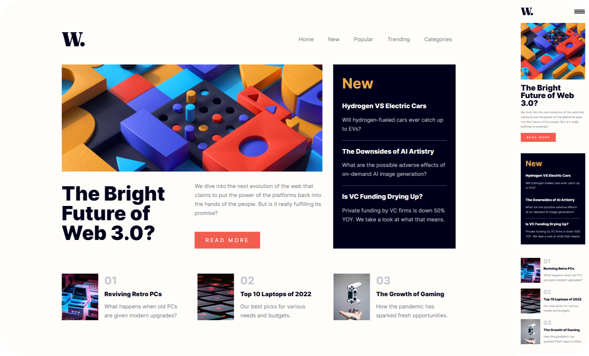

# Frontend Mentor - News homepage solution

This is a solution to the [News homepage challenge on Frontend Mentor](https://www.frontendmentor.io/challenges/news-homepage-H6SWTa1MFl).

## Table of contents

- [Frontend Mentor - News homepage solution](#frontend-mentor---news-homepage-solution)
  - [Table of contents](#table-of-contents)
  - [Overview](#overview)
    - [The challenge](#the-challenge)
    - [Screenshot](#screenshot)
    - [Links](#links)
  - [My process](#my-process)
    - [Built with](#built-with)
    - [What I learned](#what-i-learned)
    - [Optimizations](#optimizations)
  - [Author](#author)

## Overview

### The challenge

Users are able to:

- View the optimal layout for the interface depending on their device's screen size
- See hover and focus states for all interactive elements on the page

### Screenshot



### Links

- Solution URL: [Solution](https://www.frontendmentor.io/solutions/responsive-newspaper-homepage-with-sass-and-flexbox-Gv8R58_31L)
- Live Site URL: [Live site](https://marijanasevo.github.io/news-homepage/)

## My process

### Built with

- Semantic HTML5 markup
- CSS custom properties
- Flexbox
- Sass
- JavaScript

### What I learned

I practiced Sass, its functions, how partials could be organized and BEM in this solution (class names can really be long but I never regreted using BEM) since it goes well with Sass, as well as building a page exactly by design. JavaScript determines device's width to decide if website should use a burger button menu or a regular menu, disables scrolling, appends a dark overlay behind the menu in its active state etc. 

Learned more about responsive typography and some newer CSS functions: 
```css
/*         clamp(min, prefered and a maximum value) */
font-size: clamp(4rem, 2.3vw + 2.2rem, 5.3rem);

/**
  Magic formulas that will take responsivness to the moon 
  https://vayo.hashnode.dev/how-to-make-websites-responsive-for-all-devices
*/

p { font-size: min(6vmin, calc(1rem + 0.23vmax), 2rem); }

/* Headings might require min (7.5vmin) and prefered value (2rem) tweaking to adjust */
h1 { font-size: min(7.5vmin, calc(2rem + 1.2vmax)); }
```

### Optimizations

There is a small animation that could be optimized. It's caused by toggling the class while resizing the window and passing the mobile interface breakpoint. _I like it because it adds the effect that menu changed its form._ 

A SEO person told me once that older people might have trouble figuring out hamburger menus or even recognizing it so maybe this animation could be helpful and attract their attention. It's not a bug, it's a feature.

## Author

- Website - [webdevlpr.com](https://webdevlpr.com/)
- Frontend Mentor - [@Curiositz](https://www.frontendmentor.io/profile/Curiositz)
